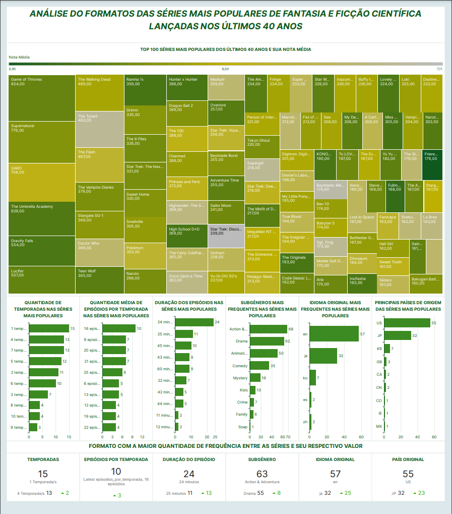

# Desafio

O desafio consiste na construção de um Data Lake para filmes e séries, dividido em 5 entregas, 1 em cada sprint. Nas entregas serão realizadas a Ingestão, o Armazenamento, o Processamento e o Consumo dos dados.

# Análise dos dados (Atualizado)

- Quais são os filmes mais rentáveis do gênero Ficção Científica do século atual e quais os subgêneros que mais aparecem?
    Com essa análise, podemos identificar os maiores sucessos (financeiros) desse gênero e quais combinações de gêneros (com o gênero Ficção Científica) oferecem maior retorno.

- Quais são as séries do gênero Fantasia e Ficção Científica com a maior popularidade e boa avaliação (nota acima de 7 e no mínimo 10 votos) nos últimos 40 anos e qual formato poderia ser o melhor para aplicar em uma série desse mesmo gênero?
    Com essa análise, podemos verificar quais séries conseguiram manter uma boa qualidade, grande popularidade e por quanto tempo elas duraram. Além disso, analisar dados como quantas temporadas tiveram, a quantidade média de episódios por temporada, o país de origem, a língua original, entre outros dados, para estudar melhor quais formatos tiveram maior sucesso.

    
# Entrega 4 (Atualizado)

- Processamento dos arquivos sobre séries:
    - No job [job_mdl_sff_dimensionamento_series](../Desafio/etapa-0/job_mdl_sff_dimensionamento_series.py), fiz uma pequena alteração na linha 97 na geração dos IDs da tabela dim_duracao para gerar IDs diferentes para linhas que tivessem toda a sua sequência de dados diferentes.

# Entrega 5

## Conjunto de Dados:

1. Primeiro selecionei a fonte de dados:

    

2. Depois escolhi o banco de dados e as tabelas fatos em cada conjunto de dados:

    
    

3. Depois em cada conjunto de dados adicionei as tabelas dimensões:

    
    

    
    

4. No conjunto de dados de filmes, fiz uma filtragem geral dos dados para utilizar dados baseados em grandes investimentos e que estivessem atualizados:

    

5. E por fim, mantive apenas os campos que utilizei nos gráficos e renomeei alguns que eram necessários:

    
    

## Pergunta 1: 

Minha análise sobre filmes se desenvolveu a partir da pergunta: "Quais são os filmes mais rentáveis do gênero Ficção Científica do século atual e quais os subgêneros que mais aparecem?"

Para obter os dados sobre filmes, utilizei as tabelas no modelo dimensional que estão no datalake que criei durante a resolução do desafio, dos dados que vieram, fiz o calculo de algumas colunas para que fossem mostrados os lucros, receitas e orçamento num valor percentual e também fiz esse calculo em cima do agrupamento de filmes por generos.

O meu objetivo com os dados coletados é analisar quais filmes lançados neste século proporcionaram maior retorno financeiro e identificar quais combinações de gênero com o gênero Ficção Científica podem gerar um investimento seguro (ou não) com base no investimento feito. Logo, analisar com base no orçamento qual foi o lucro gerado por esse investimento.

Com os dados coletados e estruturados, consegui definir qual foi o lucro obtido em cada filme. Contudo, percebi que havia filmes com pouco investimento que tinham grandes retornos financeiros, e usar a porcentagem de lucro sobre o que foi investido seria mais interessante e faria mais sentido. Além disso, usar porcentagem evitaria a necessidade de atualizar os valores, já que são dados de muitos anos. Assim, gerei a partir dos dados disponíveis quanto um orçamento teve de aumento comparado à sua receita, ou seja, qual a porcentagem de lucro houve sobre o seu orçamento. Fiz o agrupamento de filmes por gênero e fiz o mesmo calculo em cima dos valores de orçamento e lucro.

Ao analisar os dados extraídos, consegui ainda incrementar outra análise no dashboard: considerando os meses em que esses filmes foram lançados, os gêneros mais rentáveis e apenas os filmes que tiveram algum lucro, podemos ver em que mês do ano poderia ser mais apropriado o lançamento desses filmes.

### Gráficos:

- 2 gráficos de barras horizontais: Esses gráficos mostram os filmes com maior porcentagem de lucro sobre o orçamento e aqueles com maior lucro bruto (receita - orçamento). Permitindo sua comparação. 

    
    
    - Isso evidência por que a análise baseada na porcentagem de lucro faz mais sentido, especialmente ao considerar filmes com baixos orçamentos que obtêm retornos expressivos.

- 2 gráficos de barras verticais: No primeiro, analiso a porcentagem de lucro e de orçamento no total da receita adquirida dos filmes que estão no topo dos mais rentáveis (filmes com maior lucro sobre o orçamento). No segundo gráfico, analiso a porcentagem de receita e de prejuízo no orçamento total dos piores filmes.

    
    
    - Assim, concretizo a importância de analisar a porcentagem sobre o orçamento, observando como a proporção muda conforme passamos pelos filmes mais rentáveis. Algo semelhante acontece com os filmes que geraram prejuízo, observando apenas seu orçamento, já que a receita não conseguiu superá-lo, tornando-os filmes que resultaram em prejuízo.

- 1 gráfico de nuvem de palavras: Nele, analiso quantas vezes cada gênero aparece entre os filmes que obtiveram lucro.

    
    - Assim, identifico a frequência de gêneros além do principal.

- 1 gráfico de mapa de árvore: Nele, analiso a porcentagem de lucro que todos os filmes de cada gênero obtiveram em relação ao orçamento.

    
    - O gráfico de mapa de árvore mostra quanto os filmes de cada gênero lucraram proporcionalmente sobre o orçamento, permitindo identificar quais gêneros oferecem o melhor retorno financeiro em relação ao investimento.

- 1 gráfico de barras verticais: Para contar quantos filmes foram lançados em cada mês entre os filmes que tiveram lucro superior a 0 no gênero com melhor performance.

    
    - Dessa forma, podemos analisar em quais meses se concentram os filmes que obtiveram lucro em um gênero específico.

Em todos esses gráficos apliquei o seguinte filtro:

### Dashboard: 

[Dashboard em PDF](../Desafio/etapa-1/Dashboard%20Filmes%20-%20Pergunta%201.pdf)

Ao analisar os dados e os gráficos apresentados no dashboard, estúdios e produtores devem considerar essas tendências de combinação de gêneros e meses de lançamento para maximizar o retorno de seus investimentos. Ao evitar combinações de baixo retorno e programar lançamentos em meses estratégicos, será possível maximizar os lucros e minimizar os riscos.

## Pergunta 2:

Minha análise sobre séries se desenvolveu a partir da pergunta: "Quais são as séries do gênero Fantasia e Ficção Científica com a maior popularidade e boa avaliação (nota acima de 7 e no mínimo 10 votos) nos últimos 40 anos e qual formato poderia ser o melhor para aplicar em uma série desse mesmo gênero?"

Para obter os dados sobre séries, utilizei as tabelas no modelo dimensional que estão no datalake que criei durante a resolução do desafio, ao dados que vieram, apenas fiz o calculo de uma coluna para obter a quantidade média de episódios por temporada.

Meu objetivo com os dados coletados é identificar quais são as séries mais populares lançadas nos últimos 40 anos e qual formato (idioma e país original, quantidade de temporadas, episódios, duração dos episódios e o gênero) é mais comum entre as séries populares, para seguir esse padrão.

Embora tenha identificado os dados que são mais frequentes entre as séries populares, notei que, ao selecionar apenas dados que contêm o item mais frequente, como o idioma orignal, por exemplo, todos os outros dados da análise mudam. Para demonstrar isso, usei ações no dashboard com gráficos que mostram a frequência de cada item nos dados. Cada item que seleciono para a filtragem das séries faz com que todos os demais itens sofram mudanças. Acredito, assim, que uma possível melhoria seria permitir que o usuário interagisse com o dashboard, definindo itens como prioridade para possíveis seleções até chegar a um resultado definitivo.

### Gráficos:

- 1 gráfico de mapa de árvore: Para mostrar o top 100 de séries mais populares e suas notas médias através da coloração do gráfico.

    
    - Dessa forma, podemos visualizar quais séries fizeram mais sucesso nos últimos 40 anos.

- 6 gráficos de barras horizontais: Com esses gráficos, mostro os principais itens que aparecem em cada formato.

    
    
    
    
    
    
    - Assim, é possível usar ações nos gráficos e selecionar os itens que desejo que a série contenha.

- 6 indicadores de desempenho (KPIs): Nesses gráficos, é mostrado o formato de cada item mais frequente entre o top 100 em popularidade dos dados analisados.

    
    
    
    
    
        
    - Esses gráficos oferecem uma visão clara dos formatos de séries que tiveram sucesso e podem ser usados para tomar decisões na escolha de um formato que poderia ajudar uma série a ter uma boa popularidade.

Em todos esses gráficos apliquei o seguinte filtro:

### Dashboard: 

[Dashboard em PDF](../Desafio/etapa-1/Dashboard%20Series%20-%20Pergunta%202.pdf)

Ao analisar os dados e os gráficos apresentados no dashboard, estúdios de TV ou streamings podem maximizar o sucesso de suas produções ao seguir os formatos identificados como populares, otimizando suas chances de atrair anunciantes e patrocinadores. Isso é relevante, pois uma das principais formas de monetizar uma série é por meio de anunciantes que buscam séries populares para aproveitar comerciais e "patrocínios".

No entanto, durante o desenvolvimento, percebi que o dashboard com interatividade poderia funcionar também como um filtro para usuários comuns, permitindo que eles encontrem séries com especificidades entre os itens analisados.