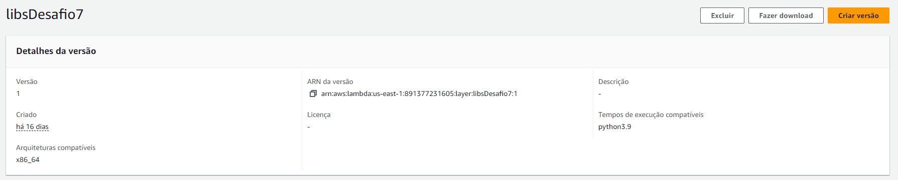
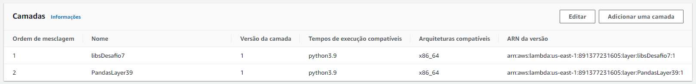
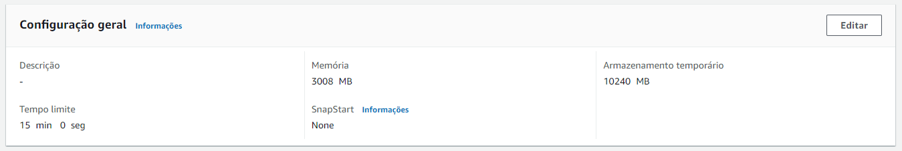
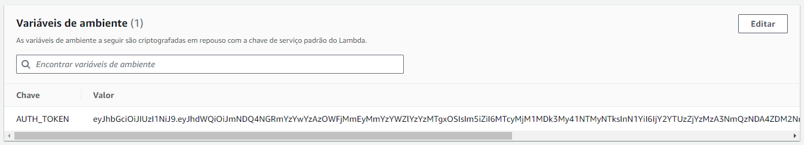
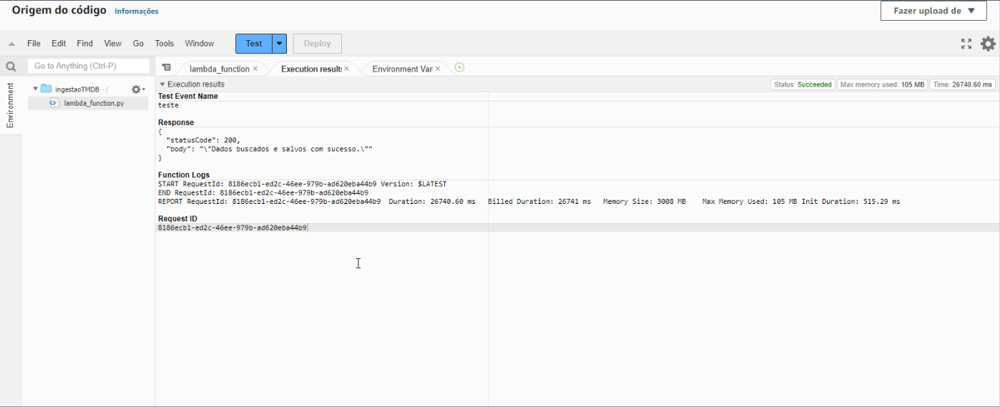
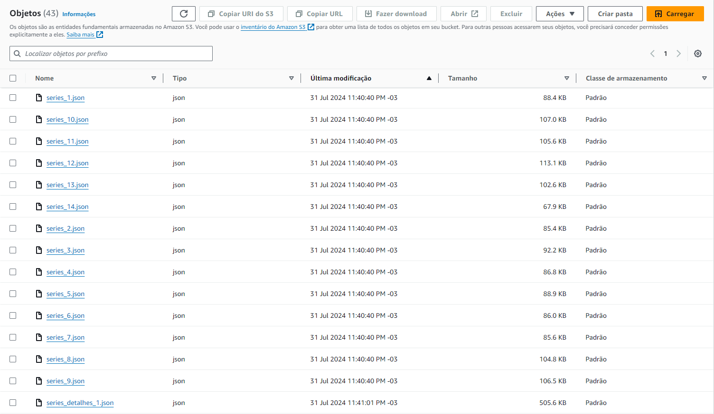
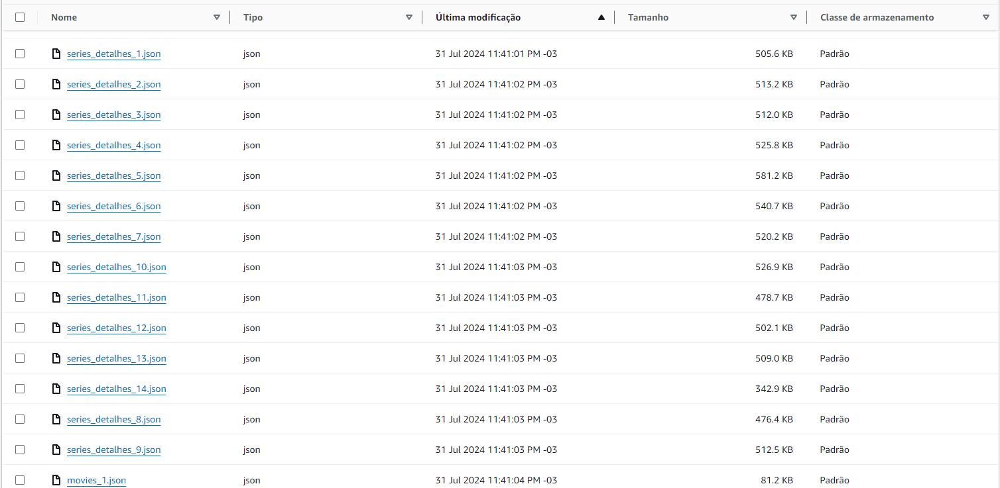
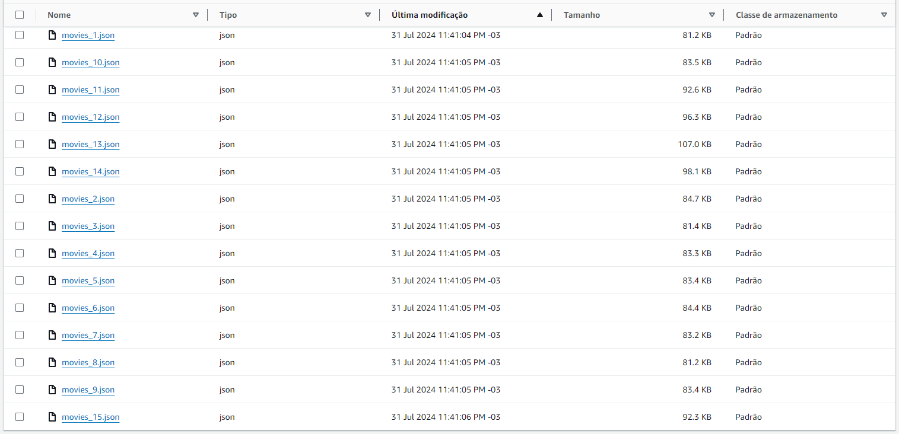

# Desafio

O desafio consiste na construção de um Data Lake para filmes e séries que está dividido em 5 entregas, 1 em cada sprint. Nas entregas serão realizadas a Ingestão, o Armazenamento, o Processamento e o Consumos dos dados.


# Análise dos dados (Atualizado)

- Quais são os 10 filmes mais populares do gênero Fantasia e do gênero Ficção Científica de cada década (das últimas 5 décadas)?
    Com essa análise podemos ver os maiores sucessos de cada gênero entre as gerações e as mudanças de gosto do público em cada gênero ao passar das décadas.

- Quais as 10 séries do gênero Fantasia e Ficção Científica que mais duraram em anos e que foram mais bem avaliadas?
    Com essa análise podemos ver quais séries conseguiram manter a qualidade por mais tempo e poder estudar melhor o motivo de seu sucesso continuo através dos vários anos que ficaram no ar.


# Entrega 2

## Camada(layer)

1. Criei o arquivo [dockerfile](../Desafio/etapa-1/dockerfile) para criar uma imagem do amazonlinux com o python e o pip instalado. Fiz a criação da imagem usando o comando ```docker build -t python39api .```.


2. Iniciei um container para executar o python e o shell Bash dentro do contêiner usando o comando ```docker run --name consultaAPI -it amazonlinuxpython39 bash```.


3. Fiz a criação das pastas layer_dir/python/ dentro da pasta root pelo bash:
    ```
    bash-5.2# ls
    bin  boot  dev  etc  home  lib  lib64  local  media  mnt  opt  proc  root  run  sbin  srv  sys  tmp  usr  var
    bash-5.2# cd root
    bash-5.2# cd ~ 
    bash-5.2# mkdir layer_dir
    bash-5.2# cd layer_dir/
    bash-5.2# mkdir python
    bash-5.2# cd python/
    bash-5.2# pwd
    /root/layer_dir/python
    ```


4. Dentro da pasta python, instalei as bibliotecas requests, boto3 e tmdbv3ap com o comando ```pip install requests boto3 tmdbv3api -t .```


5. Compactei todos esses arquivos em um arquivo chamado [camada-requests-boto3-tmdbv3api.zip](../Desafio/etapa-1/camada-requests-boto3-tmdbv3api.zip) com o comando ```zip -r camada-requests-boto3-tmdbv3api.zip .```

    Em um novo terminal, descori o id do container com ```docker container ls``` para usa-lo no comando:
    ```docker cp 708810a710b5:/root/layer_dir/camada-requests-boto3-tmdbv3api.zip ./```
    Que fez a cópia do arquivo .zip para a pasta que eu estava localizado.

    Fiz o upload do arquivo zipado no bucket do desafio em uma pasta chamada libs.


6. No AWS Lambda selecionei a aba camadas e fiz a criação de uma camada e nomeei de libsDesafio7, fiz o upload do arquivo com as biblotecas usando o arquivo no S3, selecionei a arquitetura x86 e a versão 3.9 do Python.
    


## Função Lambda

1. Fiz a criação de uma funçaõ e nomeei de ingestãoTMDB, selecionei a arquitetura x86 e a versão 3.9 do Python. No IAM, fui na função ligada a essa função lambda e dei as [permissões necessárias](../Desafio/etapa-1/Permissao-IngestaoTMDB%20.json) para a execução do código.


2. No fim da função, adicionei a camada personalizada criada anteriormente ```libsDesafio7``` e uma camada que usei em um exercício anterior que contém a biblioteca Pandas ```PandasLayer39```.



3. Aumentei o tempo limite, a memória e o armazenamento temporário para que a função executasse sem interrupções:



4. Criei uma variável de ambiente para armazenar o token da API.



5. Por fim, desenvolvi o [código python](../Desafio/etapa-1/lambda_function.py) para fazer chamadas na API do TMDb e armazenar os resultados no bucket S3.
    - Fiz a importação das bibliotecas necessárias;
    - Fiz a chamada da variável de ambiente;
    - Inicializei um cliente S3 para salvar os dados no bucket;
    - Desenvolvi as funções para fazer a busca de filmes, séries e seus detalhes na API de acordo com a pergunta do desafio coletando somente filmes e séries que fazem parte do escopo da análise, como os o gêneros, o ano em que foi lançado, a quantidade de votos e a média de votos para dados que chegaram a ser avaliados por um número mínimo de pessoas e que tiveram um bom resultado, para evitar que ultrapassasse o limite de 10MB estipulado no desafio;
    - Desenvolvi também uma função para salvar os dados no bucket S3 no formato JSON com a estrutura de diretórios indicada no desafio;
    - E na função lambda_handler é feita as chamadas das funções, dividindo o resultado das consultas na API em no máximo 100 registros por arquivo conforme solicitado no desafio.
    
    
    
    
