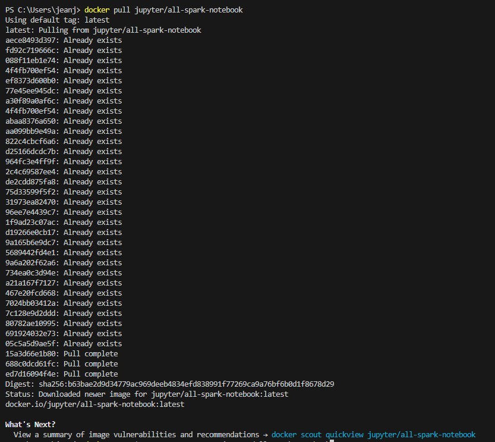
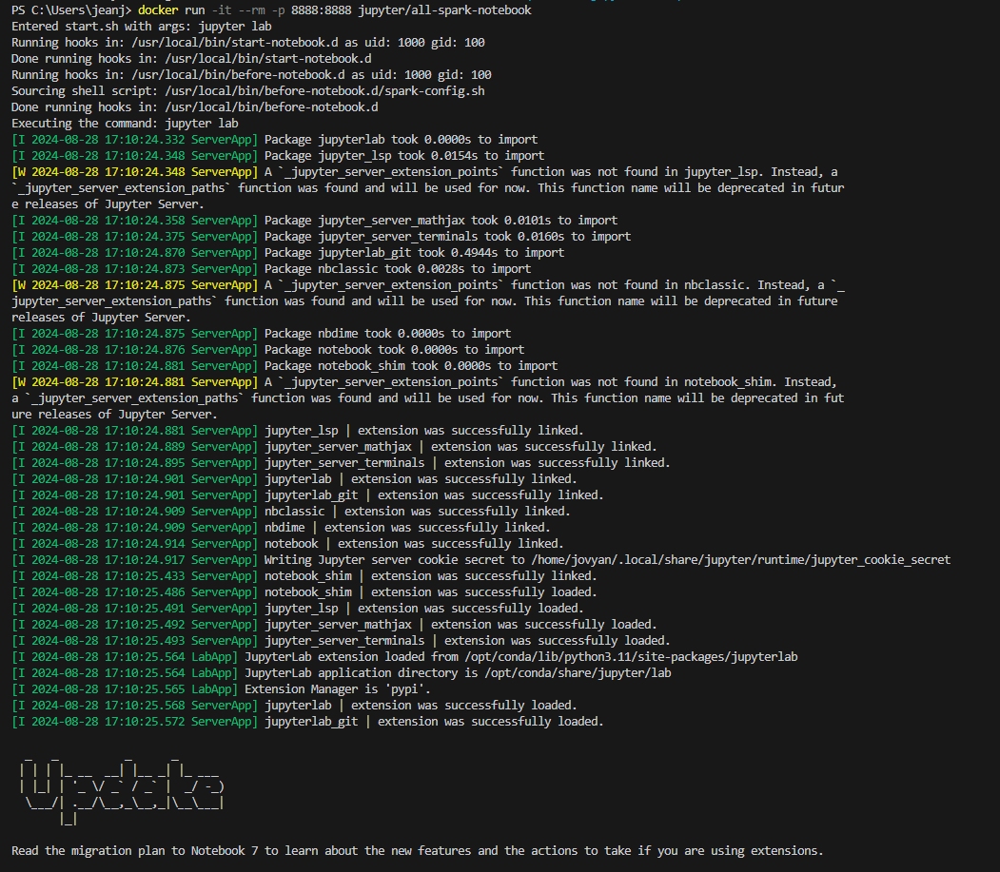
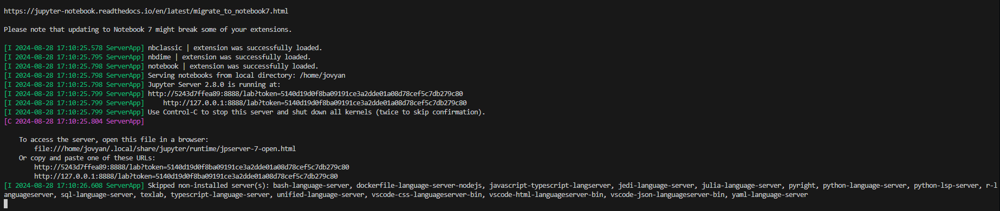
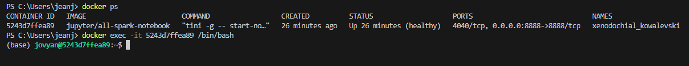
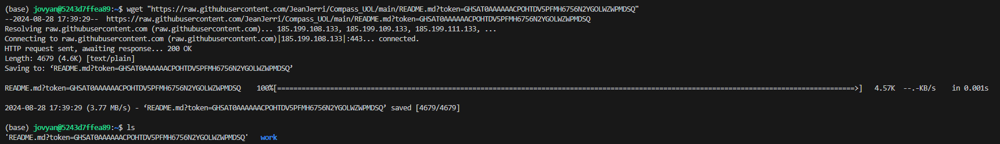
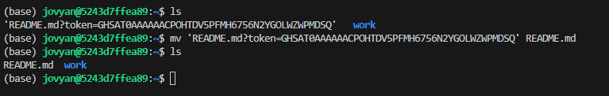
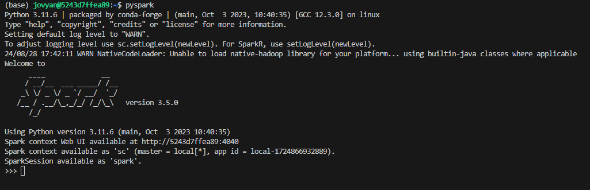
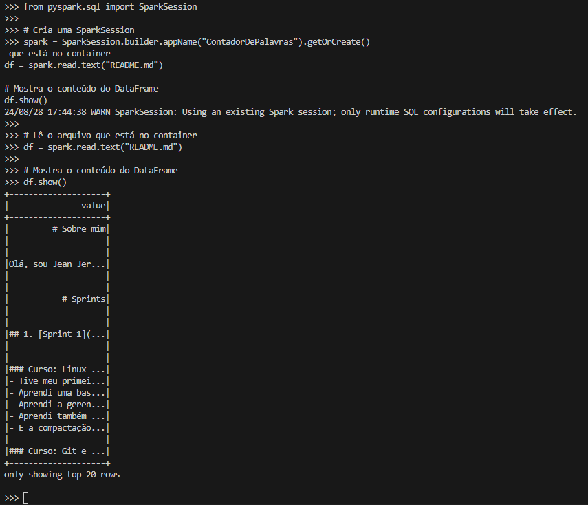
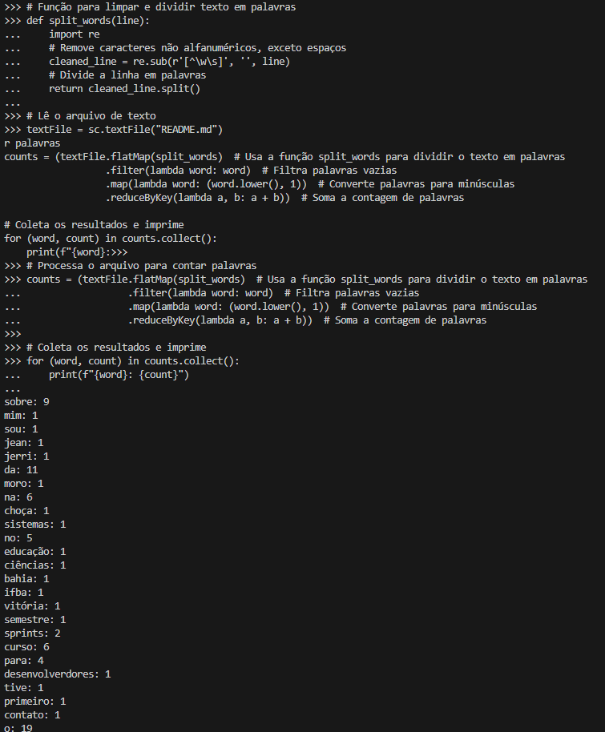

# Exercícios


## Etapa 1
- Nesta atividade fiz o uso da imagem jupyter/all-spark-notebook(https://registry.hub.docker.com/r/jupyter/all-spark-notebook) para criar um container e utilizar o recurso de shell oferecido pelo Spark. Os passos a executar são:
- Fiz o pull da imagem Docker jupyter/all-spark-notebook usando o comando:
```docker pull jupyter/all-spark-notebook```


# Etapa 2
- Iniciei um container a partir da imagem em modo interativo com o Jupyter Lab e Spark, usando o comando:
```docker run -it --rm -p 8888:8888 jupyter/all-spark-notebook```


- Procurei pela linha que começa com http://127.0.0.1:8888/lab?token=.... Copiei este link e colei no navegador para acessar o Jupyter Lab.

# Etapa 3
- Abri outro terminal e descobri o id do container em execução com o comando ```docker ps```.
- Depois acessei o container com o comando: ```docker exec -it e7f6188b677b /bin/bash```


- Instalei o wget usando o ```pip install wget```.
- Baixei o arquivo readme no container pelo wget usando o link raw:
```wget "https://raw.githubusercontent.com/JeanJerri/Compass_UOL/main/README.md?token=GHSAT0AAAAAACPOHTDV5PFMH6756N2YGOLWZWPMDSQ"```


- Mudei o nome do arquivo com:
```mv 'README.md?token=GHSAT0AAAAAACPOHTDU6VTKCR4S5YWZEJ5UZVVAEBA' README.md```


- No terminal do container, executei:
```pyspark```


# Etapa 4
Testei o código no jupyter notebook e depois executei no terminal com pyspark:
```
from pyspark.sql import SparkSession

# Cria uma SparkSession
spark = SparkSession.builder.appName("ContadorDePalavras").getOrCreate()

# Lê o arquivo que está no container
df = spark.read.text("README.md")

# Mostra o conteúdo do DataFrame
df.show()
```


Código completo:
```
# Função para limpar e dividir texto em palavras
def split_words(line):
    import re
    # Remove caracteres não alfanuméricos, exceto espaços
    cleaned_line = re.sub(r'[^\w\s]', '', line)
    # Divide a linha em palavras
    return cleaned_line.split()

# Lê o arquivo de texto
textFile = sc.textFile("README.md")

# Processa o arquivo para contar palavras
counts = (textFile.flatMap(split_words)  # Usa a função split_words para dividir o texto em palavras
                  .filter(lambda word: word)  # Filtra palavras vazias
                  .map(lambda word: (word.lower(), 1))  # Converte palavras para minúsculas
                  .reduceByKey(lambda a, b: a + b))  # Soma a contagem de palavras

# Coleta os resultados e imprime
for (word, count) in counts.collect():
    print(f"{word}: {count}")
```



# Desafio


- [Entrega do Desafio](../Sprint%207/Desafio/README.md)