# Desafio

O desafio consiste na construção de um Data Lake para filmes e séries que está dividido em 5 entregas, 1 em cada sprint. Nas entregas seram realizadas a Ingestão, o Armazenamento, o Processamento e o Consumos dos dados.


# Análise dos dados

- Quais são os 10 filmes mais populares do gênero Fantasia e do gênero Ficção Científica de cada década (das últimas 5 décadas)?
    Com essa análise podemos ver os maiores sucessos de cada gênero entre as gerações e as mudanças de gosto do público em cada gênero ao passar das décadas.

- Quais as 10 séries do gênero Fantasia e Ficção Científica que mais duraram em anos e que foram mais bem avaliadas?
    Com essa análise podemos ver quais séries conseguiram manter a qualidade por mais tempo e poder estudar melhor o motivo de seu sucesso continuo através dos vários anos que ficaram no ar.


# Entrega 2 (Atualização)

## Função Lambda

- No [código python](../Desafio/etapa-1/lambda_function.py) adicionei algumas funções para fazer a consulta dos ids do tmdb das séries e filmes buscadas pelas funções criadas na sprint anterior e também uma função para consultar os nomes do gêneros correspondentes aos ids retornado na coluna e armazenar os resultados no bucket S3. Dessa forma, permitindo fazer a complementação dos dados locais que estão na camada Raw em formato csv. As demais funções mantive como estava, fiz apenas algumas adaptações necessárias para o código funcionar corretamente.
    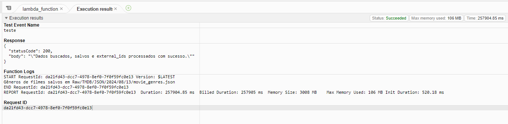
    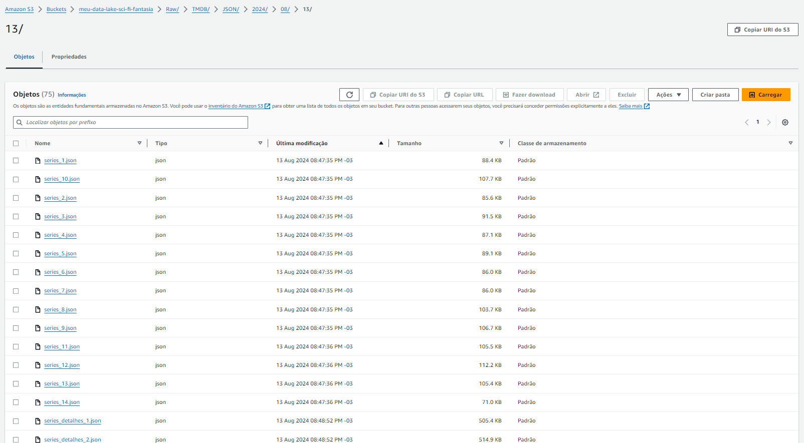
    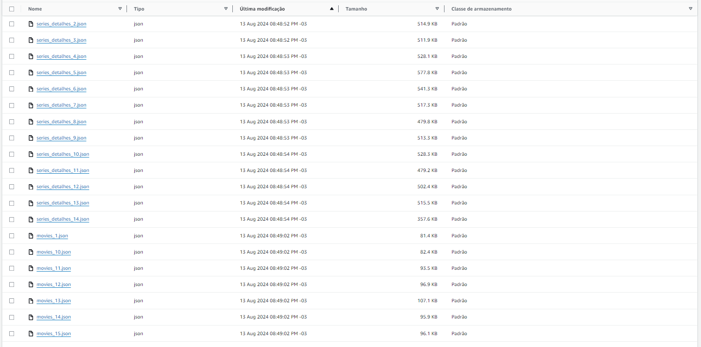
    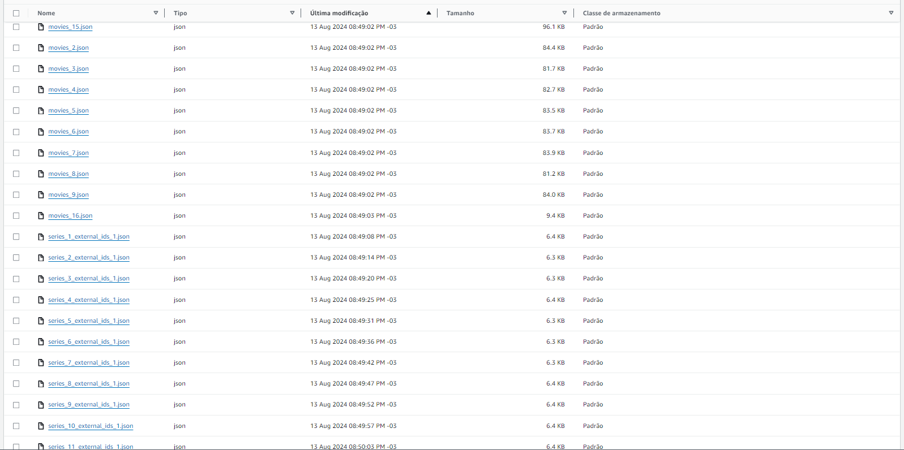
    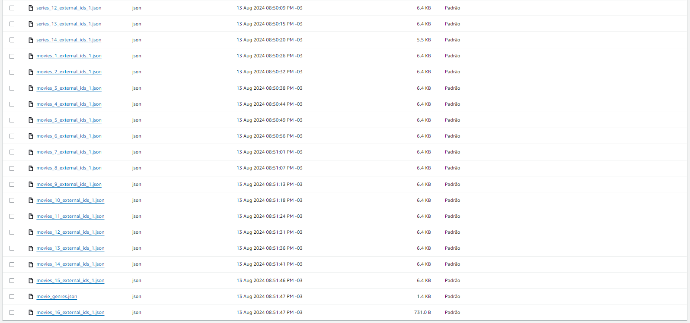


# Entrega 3

## Função Lambda

1. Como no Lab AWS Glue da sprint passada foi feito a configuração para utilizar o AWS Glue e foi criado a IAM Role para os jobs do AWS Glue, não precisei fazer essa parte novamente.
    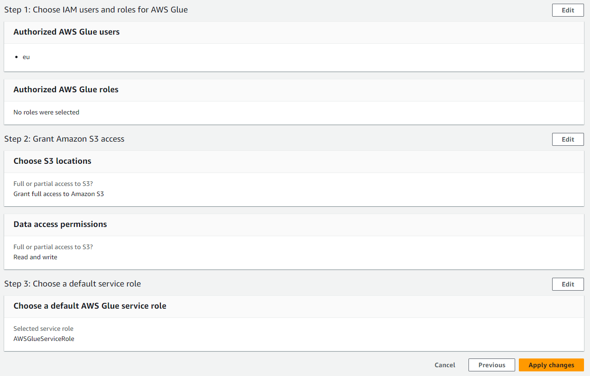
    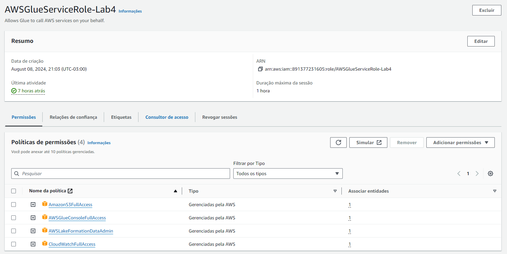

2. Criei o banco de dados para adicionar as tabelas através dos dados que serão processados na camada trusted posteriormente e nomeei como ```meu-data-lake-sci-fi-fantasia-glue-data-catalog``` e adicionei meu usuário IAM como administrador do data lake. Também concedi privilégios para a role do IAM criada anteriormente (AWSGlueServiceRole-Lab4) e dei as permissões de Create table, Alter, Drop e Describe.
    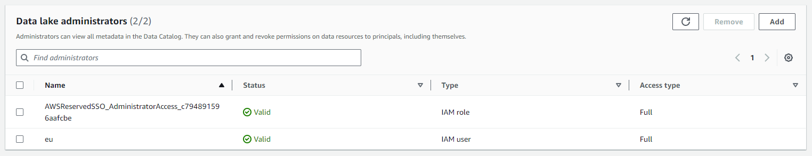
    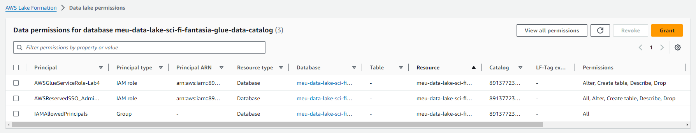

3. Criei 2 jobs com as seguintes configurações:
    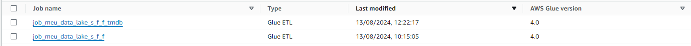
    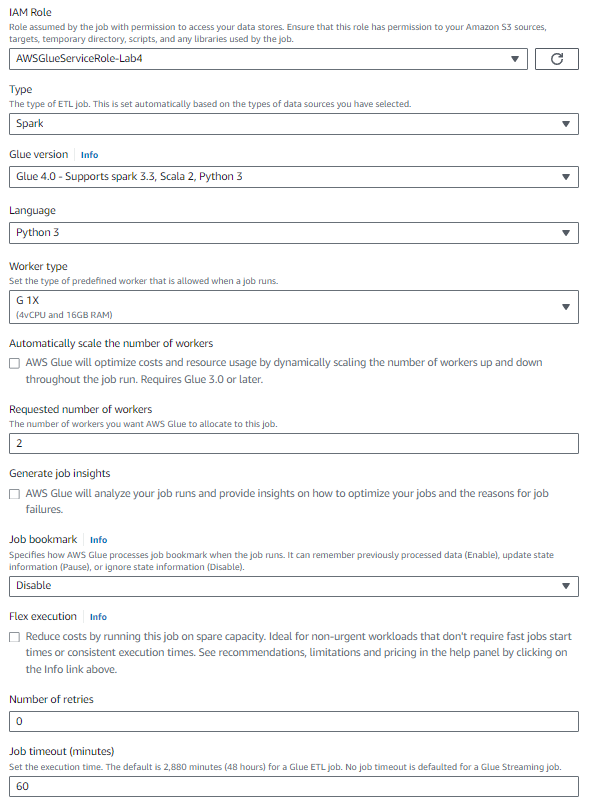

4. Processamento dos arquivos CSV:
    - No job [job_meu_data_lake_s_f_f](../Desafio/etapa-1/job_meu_data_lake_s_f_f.py) fiz a importação das bibliotecas necessárias e configurei os argumentos para os caminhos de entrada e saída dos arquivos. 
    - Fiz a leitura dos arquivos CSV que estão no bucket S3 e converti eles para um DataFrame do Spark para facilitar o processamento e aplicação das transformações. 
    - Fiz a filtragem de acordo com o escopo da pergunta do desafio final (mantive algumas informações que estavam nulas para verificar a possibilidade de preencher essas informações com os dados da API posteriormente) e selecionei apenas as colunas que irei utilizar na análise e removi as linhas duplicadas. 
    - Também fiz a correção do nome da coluna tituloPrincipal. 
    - No fim, salvei os arquivos transformados no formato parquet na camada trusted no bucket do desafio.

5. Processamento dos arquivos CSV:
    - No job [job_meu_data_lake_s_f_f_tmdb](../Desafio/etapa-1/job_meu_data_lake_s_f_f_tmdb.py) fiz a importação das bibliotecas necessárias e configurei os argumentos para os caminhos de entrada e saída dos arquivos. 
    - Listei todos os arquivos que foram gerados através da consulta na API e classifiquei em diferentes categorias de acordo com os nomes dos arquivos pois cada padrão de nomenclatura tem uma estrutura diferente. 
    - Fiz a leitura dos arquivos JSON listados com o multiline para lidar com JSONs que possuem múltiplas linhas e converti eles para um DataFrame do Spark para facilitar o processamento e aplicação das transformações.
    - Fiz o join dos arquivo com dados sobre séries em um arquivo só e fiz o mesmo com os arquivos com dados sobre filmes usando a coluna id como chave.
    - Renomeei todas as colunas deixando o mais próximo do padrão dos nomes das colunas do csv e fiz algumas transformações na coluna genero e  minutosPorEpisodio para ficar na mesma estrutura do csv.
    - Também criei novas colunas extraindo o ano de lançamento e primeira exibição de filmes e séries, respectivamente.
    - No fim, salvei os arquivos transformados no formato parquet na camada trusted no bucket do desafio, particionados por ano de lançamento e primeira exibição.

6. Por último fiz a criação de um crawler e vinculei as pastas onde foram armazenados o resultado dos processamentos na camada trusted para após ser executado, criar as tabelas e disponibilizar no AWS Athena.
    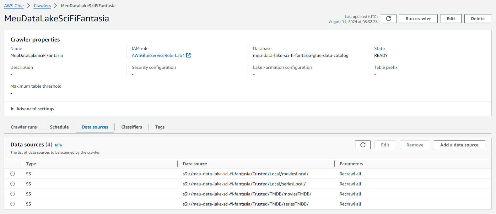
    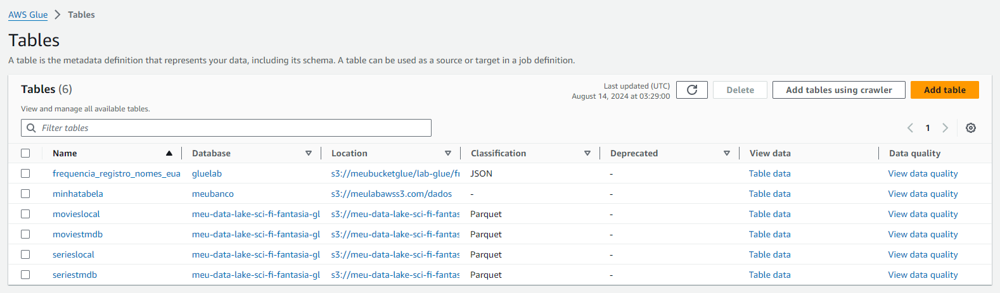
    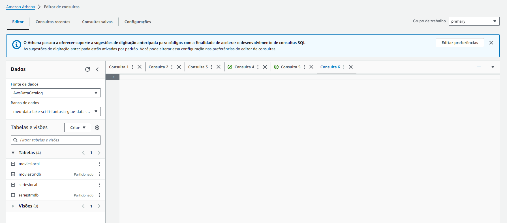