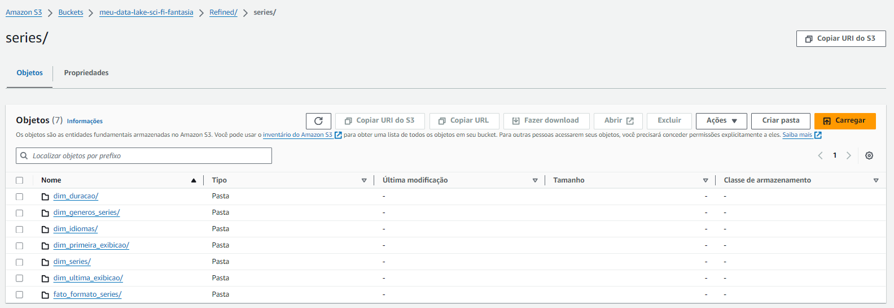

# Desafio

O desafio consiste na construção de um Data Lake para filmes e séries, dividido em 5 entregas, 1 em cada sprint. Nas entregas serão realizadas a Ingestão, o Armazenamento, o Processamento e o Consumo dos dados.


# Análise dos dados (Atualizado)

- Quais são os filmes mais rentáveis do gênero Fantasia ou do gênero Ficção Científica do século atual e quais os subgêneros que mais aparecem entre os 100 primeiros?
    Com essa análise, podemos identificar os maiores sucessos (financeiros) de cada gênero e quais combinações de gêneros (além do gênero Fantasia ou Ficção Científica) oferecem maior retorno.

- Quais são as séries do gênero Fantasia e Ficção Científica com a maior popularidade e boa avaliação (nota acima de 7 e no mínimo 10 votos) nos últimos 40 anos e qual formato poderia ser o melhor para aplicar em uma série desse mesmo gênero?
    Com essa análise, podemos verificar quais séries conseguiram manter uma boa qualidade, grande popularidade e por quanto tempo elas duraram. Além disso, analisar dados como a quantidade de anos em que essas séries se mantiveram no ar, quantas temporadas tiveram, a quantidade média de episódios por temporada, o país de origem, a língua original, entre outros dados, para estudar melhor quais formatos tiveram maior sucesso.


# Entrega 2 (Atualizado)

- No [código python](../Desafio/etapa-0/lambda_function.py) fiz a alteração para não salvar mais a lista avulsa de filmes e séries que são resultados da busca na API, mas sim salvar os detalhes desses filmes e séries que são buscados através dos IDs retornados nessa primeira busca e que antes eu chamava de arquivo "detalhes". Para isso, acrescentei também a busca dos detalhes dos filmes. Percebi também que, em filmes, já possuía o ID do TMDb, logo, não precisei mais fazer a busca de IDs externos de filmes, e fiz a remoção dessa função. Agora, passei a salvar apenas os filmes que têm informações sobre receita maior que 0, para garantir que fossem dados úteis para a análise e que não ultrapassassem o limite de 10MB na camada Raw.

E para os IDs da série, fiz a junção de duas funções, a buscar_external_ids_tv() e a processar_external_ids(), já que tinham um único objetivo. Por fim, acrescentei a busca por gêneros de séries e adaptei a função lambda handler para rodar o código de acordo com as devidas alterações.


- [Resultado da execução(1)](../Desafio/etapa-0/evidencias/Screenshot_657.png)
- [Resultado da execução(2)](../Desafio/etapa-0/evidencias/Screenshot_658.png)


# Entrega 3 (Atualizado)

- Modifiquei os jobs, já que os dados da camada Raw mudaram. 
    

- No [job_meu_data_lake_s_f_f-v2](../Desafio/etapa-0/job_meu_data_lake_s_f_f-v2.py) que processa os dados oriundos dos arquivos locais(csv) modifiquei a filtragem dos dados de filmes e séries e a seleção de colunas dos dados sobre filmes.

- Já no [job_meu_data_lake_s_f_f_tmdb-v2](../Desafio/etapa-0/job_meu_data_lake_s_f_f_tmdb-v2.py) que processa os dados extraídos do TMDb, modifiquei a filtragem dos arquivos para separá-los de acordo com cada estrutura (arquivos com IDs de séries, arquivos sobre filmes e séries, e arquivos com os gêneros de filmes e séries do TMDb). Fiz a leitura de todos os arquivos e selecionei as colunas necessárias para responder às perguntas, acrescentando e removendo novas colunas. Organizei o código, primeiro selecionando, transformando e criando algumas colunas e depois renomeando cada uma, e incluí a geração de 2 novas estruturas para identificar os gêneros através dos IDs.
    

- [Resultado da execução(local)](../Desafio/etapa-0/evidencias/Screenshot_662.png)
- [Resultado da execução(TMDb)](../Desafio/etapa-0/evidencias/Screenshot_663.png)

- Adicionei o endereço das 2 pastas no crawler para gerar as duas tabela de gêneros. Atualizei e gerei as novas tabelas:
    
    - [Tabelas no AWS Glue](../Desafio/etapa-1/evidencias/Screenshot_665.png)
    - [Tabelas no AWS Athena](../Desafio/etapa-1/evidencias/Screenshot_666.png)

    
# Entrega 4

1. Antes de definir o modelo dimensional, fiz a união das tabelas/dados que vinham do TMDb e do CSV através de queries no AWS Athena para analisar os dados ao mesmo tempo em que ia processando os dados.
    - Através dele fiz o join entre as tabelas de filmes e de séries, atualizando e adicionando novos dados em relação ao CSV, e fazendo o cast das colunas quando necessário.
    - Também fiz um filtro de dados de acordo com a análise que seria feita.
    - Após o join, fiz a separação de dados na coluna gêneros no join de filmes, e nas colunas país_original, idiomas, idioma_original e gêneros no join de séries.
    - Por fim, fiz o join com as tabelas de gêneros para incluir o ID dos gêneros nas tabelas de filmes e séries.
    - Também fiz uma query à parte para verificar a existência de valores nulos e tratá-los, caso fosse necessário.
        [query_join_movies.txt](../Desafio/etapa-1/query_join_movies.txt)
        [query_join_series.txt](../Desafio/etapa-1/query_join_series.txt)
        [query nulos em movies.txt](../Desafio/etapa-1/query%20nulos%20em%20movies.txt)
            
        [query nulos em series.txt](../Desafio/etapa-1/query%20nulos%20em%20series.txt)
            

2. Como no Lab AWS Glue da sprint 7 foi feito a configuração para utilizar o AWS Glue e foi criado a IAM Role para os jobs do AWS Glue, não precisei fazer essa parte novamente.
    - [Configuração para utilizar o AWS Glue](../Desafio/etapa-1/evidencias/Screenshot_622.png)
    - [IAM Role para os jobs do AWS Glue](../Desafio/etapa-1/evidencias/Screenshot_628.png)

3. Na sprint 8 foi criado e configurado o banco de dados ```meu-data-lake-sci-fi-fantasia-glue-data-catalog``` onde fiz as consultas no AWS Athena e onde salvarei as tabelas do modelo dimensional.
    - [Data lake administrators](../Desafio/etapa-1/evidencias/Screenshot_631.png)
    - [Data lake permissions](../Desafio/etapa-1/evidencias/Screenshot_630.png)

4. Criei 2 jobs com as seguintes configurações:

    
    
    

5. Processamento dos arquivos sobre filmes:
    - No job [job_mdl_sff_dimensionamento_movies](../Desafio/etapa-1/job_mdl_sff_dimensionamento_movies.py), fiz a importação das bibliotecas necessárias e configurei os argumentos para os caminhos de entrada e saída dos arquivos.
    - Fiz a leitura dos arquivos PARQUET que estão no bucket S3 e criei views temporárias para facilitar o processamento e a aplicação das transformações usando a query que eu criei no Athena.
    - Fiz o join, renomeei e fiz o cast das colunas conforme a query, e filtrei os dados necessários, porém, fiz a separação de dados na coluna gêneros usando o PySpark.
    - Usando comandos SQL novamente, fiz o join com o último join para unir com a tabela de gêneros.
    - Separei as colunas entre dataframes diferentes para formar as dimensões filmes, datas, gêneros e a fato lucro_filmes.
    - No final, salvei os arquivos transformados e particionados no formato PARQUET na camada refined no bucket do desafio.
        
    - Modelo Dimensional:
        

6. Processamento dos arquivos sobre séries:
    - No job [job_mdl_sff_dimensionamento_series](../Desafio/etapa-1/job_mdl_sff_dimensionamento_series.py), fiz a importação das bibliotecas necessárias e configurei os argumentos para os caminhos de entrada e saída dos arquivos. 
    - Fiz a leitura dos arquivos PARQUET que estão no bucket S3, com base na query que eu criei no Athena, fiz o código usando PySpark para um processamento mais rápido dos dados, pois havia uma maior quantidade de informações, mais colunas e transformações mais complexas.
    - Realizei o join, renomeei e fiz o cast das colunas conforme a query, filtrei os dados necessários, separei os dados nas colunas pais_original, idiomas, idioma_original e generos, e corrigi um dado na coluna tempo_minutos usando o PySpark que identifiquei usando o Athena.
    - Fiz o último join para unir com a tabela de gêneros e gerei as colunas id_idioma e id_duracao.
    - Separei as colunas entre dataframes diferentes para formar as dimensões series, primeira_exibicao, ultima_exibicao, generos, idiomas, duracao e a fato formato_series.
    - Por fim, salvei os arquivos transformados e particionados no formato PARQUET na camada refined do bucket do desafio.
        
    - Modelo Dimensional:
        


7. Criei um crawler e vinculei as pastas onde foram armazenados os resultados dos processamentos na camada refined. Após sua execução, o crawler criou as tabelas e as disponibilizou no AWS Athena.

    

    

    

8. E com base nas tabelas que foram criadas, criei views para auxiliar na análise das respostas das perguntas do desafio:
    - [view_pergunta_1](../Desafio/etapa-1/view_pergunta_1.txt)
    - [view_series_populares](../Desafio/etapa-1/view_series_populares.txt)
    - [view_series_longa_duracao](../Desafio/etapa-1/view_series_longa_duracao.txt)
    - [view_series_idiomas_populares](../Desafio/etapa-1/view_series_idiomas_populares.txt)

    

    
